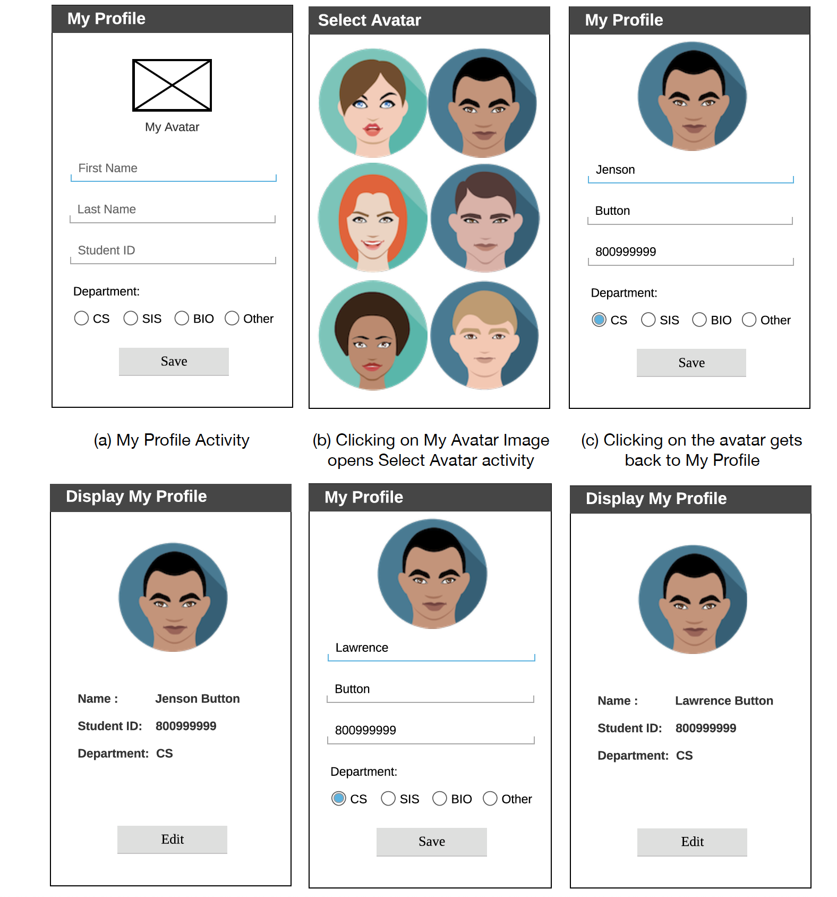

# StudentProfileBuilder

An android application where users can create and build their profile.

### My Profile Activity: 
This activity contains, one ImageView, three
EditTexts, One RadioGroup, and one Save button. 
1. Clicking on the My Avatar ImageView should take you to Select Avatar activity. 
2. User is  able to put first name, last name, and your student ID in the
corresponding EditTexts. Used hints to display the hints, ‘First Name’, ‘Last Name’,
and ‘Student ID’. Doesn't accept anything except a nine digits positive integer as the
student ID.
3. User is  able to select a department from four options: CS, SIS, BIO, and
Other. Used a RadioGroup of four RadioButtons to implement that.
4. Clicking on the Save Button starts Display My Profile activity. 

### Select Avatar Activity:
1. This activity contains six ImageViews.
2. Used the resource files to design the activity. There are six avatar images in the
resource files.
3. Clicking on any of the avatar sends the selected Image / Corresponding Data
to My Profile Activity. Used onActivityResult() to get the selected avatar in the My
Profile Activity.

### Display My Profile Activity:
1. This activity contains an ImageView, several TextViews, and a Button.
2. It displays the avatar, name, student ID, and the department.
3. Name is created concatenating the first and the last names.
4. Clicking on the Edit button sends the Data to My Profile Activity and finish the
this activity. In My Profile activity, onActivityResult(), load the image and the other
data in the corresponding EditTexts to allow the user to edit them.

